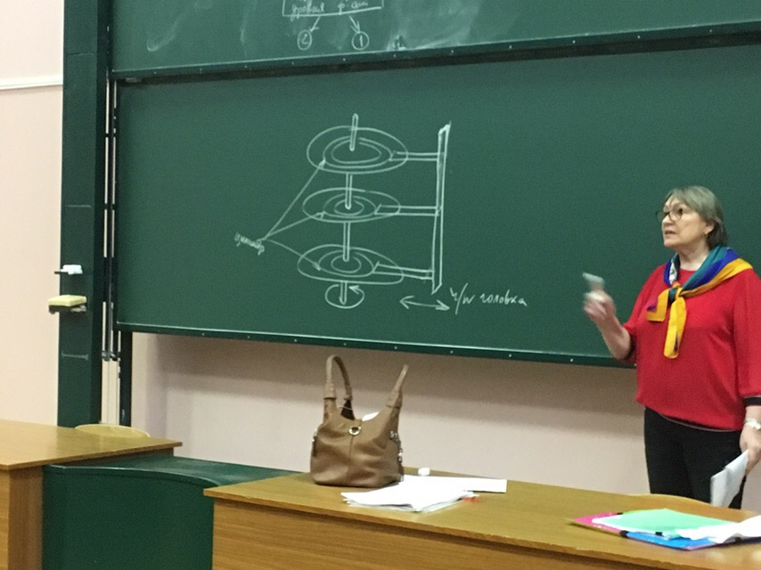
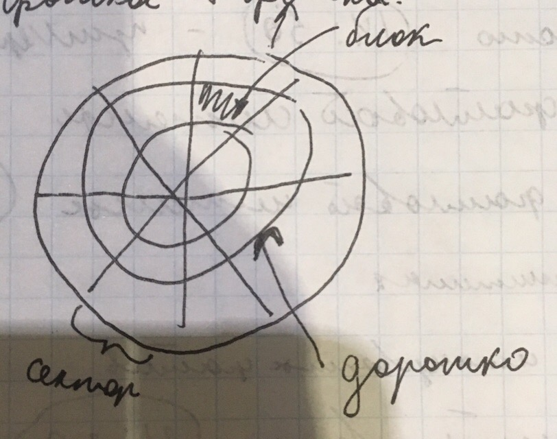
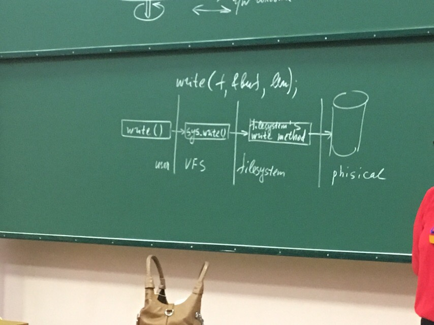
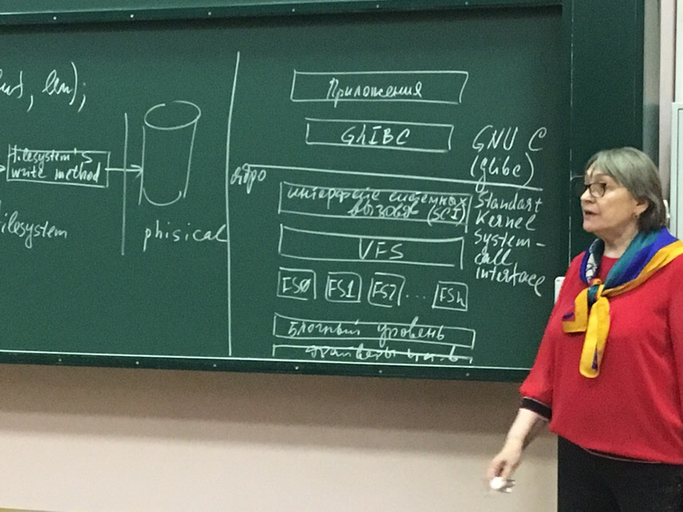
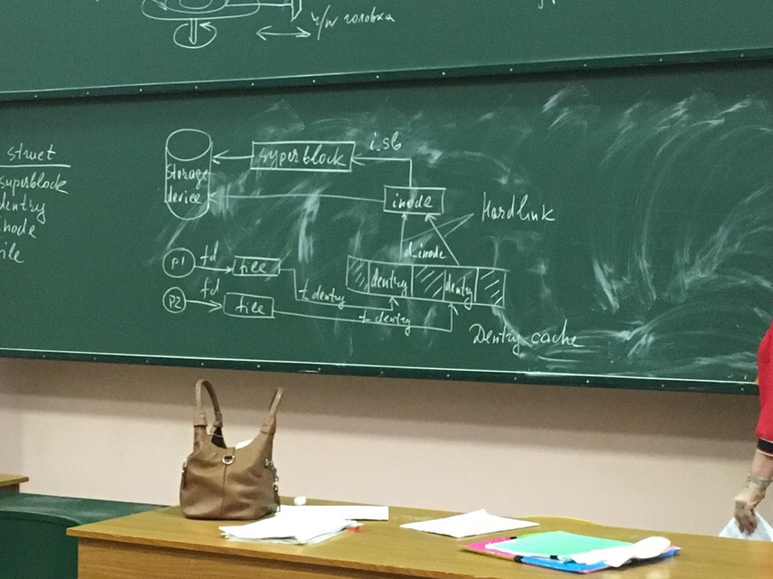

# Лекция 1 09.02.2019
* **Для чего создаем файлы?** 

Для долговременного хранения информации, для этого используются специальные внешние устройства, которые обеспечивают долговременное хранение информации: магнитные цилиндры, магнитные диски магнитные ленты, в настоящее время существует флеш-память.

---
Управление файлами осуществляется чатстью операционной системы, которую принято называть файловой системой(file system). 

**Файловая система** - это часть ОС, которая отвечает за возможность надежного и длительного хранение информации и доступа к ним. 

**Доступ** - это создание, чтение, запись, именование, переименование, удаление, изменение прав доступа и тд.

Если файл предназначен для хранения информации(данных), то файловая система управляет процессом хранения и обеспечивает последующий достпу к этой информации. То есть файл в файловой системе является единицей хранения информации. 

**Файл** - обычные файлы хранятся во вторичной памяти(это важно, бывают специальные файлы, например программные каналы pipe, они так как это буфер типа фифо, создаются в оперативой памяти( в системной области памяти), то это специальный файл). Каждая индивидуально индексировання(ключевое слово, индексированная от inode) совокупность информации называется файлом. это юниксовое определение. Каждая индивидуальная, идентифицируемая единица информации называется файлом. Каждая поименованная совокупность данным, хранящаяся во вторичной памяти, называется файлом (это лично ее определение), речь идет об обычных файлах.

---
* Файловая система определяет:
  * формат сохраняемой информации и способ ее физического хранения
  * связывает формат физического хранения и api для доступа к файлам

Файловая система не интерпретирует информацию, хранящуюся во вторичной памяти.


**Вторичная память** энергонезависимая, не нужно тратить ЛИПИЗДРИЧЕСТВО!!!11!!!11

---
**Обобщенная модель файловой под системы.** 

Как правило имеет иерархическую организацию, в ней определены определеные уровни, вышележащие уровни связаны с особенностями работы с файлами пльзователя, нижелеащие файлы связанные с аппаратным обеспечением


Это пример структурирования файловой системы. вопросы структурирования ОС при управлении информацией являются едва ли не самыми важными при разработки системы, очевидно что такое структурирование должно учитывать задачи, которые должна решать файловая система.

**Задачи файловой системы:**
  
* обеспечение удобного доступа пользователей к файлам, как часть задачи именования файлов.
* собственно именование файлов, то есть присвоение файлам уникальных идентификаторов, с помощью которых можно обеспечить доступ к файлам.
* обеспечение программного интерфейса для работы с файлами пользователей и приложений
* отображение логичской модели (логического представления) файлов на физическую организацию хранения данных на соответствующих носителях
* обеспечение надежного хранения файлов доступа к ним и обеспечение защиты от несанкционированного доступа
* обеспечение совместного использования файлов
  
---
### Символьный уровень
разные файлове ситсемы должны обеспечивать возможность существования в системе нескольких файлов с одинаковыми именами, обеспечивать возможность доступа к одному файлу по разным именам, поэтому в системах должна существовать соответствующая информация, информацию называют справочником. 

Справочник состоит из 2 частей (или состоит из 2 отдельных справочников). Символьная часть и базовая часть

**Символьный уровень** - это уровень именования файлов удобный для пользователя, это уровень каталогов и собственно имен файлов которыми оперирует пользователь и приложения. 

удобным способом структурирования объединения различных файлов являются дириктории.

---
### Базовый уровень
уровень идентификации файла. очевидно что файловая подсистема это программа, любая переменная должна быть индетифицирована.
файл должен иметь уникальный идентификатор, поскольку система должна обеспечивать возможность именования одного файла разными именами, а так же разные файлы могут иметь одно имя. Одно и тоже имя - hardlink. возможнсть именования одним именем на самом деле отсутствует **потому что имя файла состоит из 2 частей**: пути к файли и имени к файлу (нельзя в одной папке одним именем). То есть файл должен иметь уникальный идентификатор, файл должен быть описан в сстеме, чтобы мжно было с ним работать.

---
### Логический уровень
любая программа считает, что она начинается с нулевого адреса, и такое адресное пространство называется логическим. с файлами такая же история. когда создаем файл, указатель файла стоит на нулевой отметки(начало файла), то есть логически файл имеет логическое адресное пространство, которое так же начинается с нулевого адреса. логический уровень позволяет обеспечить доступ к данным в файле в формате отличным от формата их физического хранения.

логическое адресное пространство файла начинается с нулевого адреса и представляет собой непрерывную последовательность адресов. обычн

---
обычно файловая система не накладывает ограничений на внутреннюю структуру данных, которые записываются в файл и никак их не интерпретирует, структурой данных управлят пользователь, приложения пользователя а не файловая подсистема. Разные форматы хранения данных, известные только программам, которые создают файлы и работают с ними. 

например **текстовые файлы** формируются в виде последовательности сисмволов, которые объединяются в строки произвольной длинны (условно) и строка заканчивается специальным символом конец строки, потому и называются текстовыми. Для работы с текстовыми файлами предназначены текстовые редакторы, редакторы существуют именно потому что текстовых файлах информация хранится посимвольно и как известно символ занимает 1 байт, поэтому можно написать программу которая будет читать любоей текстовый файл.


---
### Байториентированные и Блокориентированные файлы
в системе существует только 2 типа устройств: символьные и блочные, это и определяет типы файлов. в байториентированных файлах информация хранится по байтам, соответственно в байториентированных устройствах передача информации осуществляется байтами. блок ориентированные файлы хранят информацию блоками фиксированного размера.

работа с внешними устройствами выполняется всегда с помощью драйверов и всегда инф, которая считывается или записывается в файл, она в системе буферизуется, это обязательное условие. 

в современых системах блок ориентированными являются только диски. 

В отличии от байториентированных файлов с блокориентированными файлами может работать только та программа, которая знает структуру блока, знает его формат. 

---
### Физический уровень хранения файлов




**сектор** - наименьший адресуемый участок конкретной пластины обределенной дорожки
**цилиндр** - совокупность одних и тех же дорожек разных пластин

адресное пространство диска выделяется файлу блоками  соответственно ситсема обеспечивает адресацию каждого конкретного блока в котором хранится информация данного файла, адресное пространство может выделяться связанное и несвязанное. Если связанное распределение, это означает что файл на диске занимает непрерывную область адресного пространства диска, то есть это смежные сектора. несвязанное распределение означает что сектора файлу выделяются в разброс, это так же означает, что система должна обеспечивать адресацию каждого отдельного блока. очевидно что несвязанное распределение более гибкое более эффективное, позволяет более эффективно использовать адресное пространство диска, но система должна обеспечивать хранения адреса каждого блока, выделенного кокнкретному файлу.
таким образом можем сказать.

---
### Представление о файловой системе
представление позволяет обеспечить общий интерфейс, причем для любой файловой системы, все файловые системы могут быть таким образом описаны и именно это позволяет создать некоторый общий интерфейс для любого типа файловой системы. это возможно потому что ядро реализует слой абстракции над своим низкоуровневым интерфейсом. именно этот подход используется в файловой подсистеме UNIX, которая реализует интерфейс названный VFS / vnode

---
### интерфейс VFS / vnode (виртуал файл систем), это юниксовый интерфейс
линукс изменил этот интерфейс, отказавшись от vnode, интерфейс в линукс называется VFS. VFS предоставляет общую файловую модель, которая способна отображать общие возможности и поведение любой мыслимой файловой системы. уровень абстракции VFS работает на основе базовых концептуальных интерфейсов и структур данных.

каждая отдельная файловая система определяет особенности того как файл открывается, как выполняется обращение к файлу, как считывается информация из файла и тому подобное.

фактический код файловых систем скрывает детали конкретной реализации, однако все файловые системы поддержвиют такие понятия как:

* файлы
* каталоги


поддерживают такие действия как :

* создание файла
* удаление файла
* переименование файла
* открытие файла
* чтение\запись файла
* закрытие файла
* и тд

большинство файловых систем запрограммировано так что, api которые предоставляют файловые системы рассматриваются как асбстрактный интерфейс, который ожидаем и понятен VFS 

например, рассмотрим запрос приложения:



(описание к фотке выше) в данном случае данное api записывает lenby(?), которые хранятся в buf, (то есть у приложения есть его адрес), в текущую позицию файла.
каждая операция read/write смещает указатель файла на определенное количество байт, значит каждая операция read/write обращается по текущей позиции, речь идет о логическом адресном пространстве файла. этот системный вызов обрабатывается цепочкой (см фото выше).
системный вызов write() сначала обрабатывается общим системным вызовом VFS, обозначен как sys.write(), затем осуществляется вызов соответствующейго системного вызова конкретной файловой системы, в данном случае для записи данных в файл.


**общие предствления о виртуальной файловой системе (оно же VFS)**



уровень VFS, а дальше уровень конкретных файловых систем

диск - блокоориентированное устройство
классическая схема предполагает хранение файлов на диске

---
### Внутренняя организация VFS 
VFS базируется на 4 структурах

* superblock -  
* dentry - сокращение двух слов directory entry
* inode - индексный узел
* file




# Семинар 23.03.19
виртуальная файловая система proc создана профессиональными разработчиками.

в файловой системе проц существуют поддиректории /proc/<pid> на каждый процесс, имя директории - идентификтор процесса. виртуальная файловая система потому что создаются на лету. о процессе система предоставляет след. инфу и досту к этой инфе осуществвляется соответствующими директориями, все сведено в таблицу

**это типа таблица**
cmdline - файл, указывает на директорию процесса 
cwd - символьическая ссылка, указывает на диркторию процесса
environ - файл, содержит список окружения процесса
exe - символическая ссылка, указывает на образ процесса(содержит путь)
fd - директория, которая содержит ссылки на файлы открытые процессом
root -символическая ссылка, указывает на корень файловой истемы процесса
stat - файл, содержит информацию о процессе

---
образ процесса - файл, так как пока не запустили программу она лежит во вторичной памяти, там она файл. любой файл пренадлежит какой-то файловой системе, родной файловой сисистемой для юникс\линукс является ext, поддерживает 7 типов файлов

пример: запускаем программу с флешки, флешка имеет собственную фалйовую систему, значит наш запущенный процесс принадлежит файловой системе флешки.

способ получить информацию о процессе - /proc/self

**пример** программы показывающей информацию о процессе (о своем окружении)

```
#include <stdio.h>
#define BUF_SIZE 0x100
int main(int argc, char *argv[])
{
    char bf[BUF_SIZE];
    int len, i;
    FILE *f;
    f = fopen("/proc/self/environ", "r") // используем fopen потому что это файловая система 
    while (len = fread(buf, 1, BUF_SIZE,f) > 0) 
    {
        for (int i = 0; i <len; i++) 
        {
            if (buf[i] ==0) 
            {
                buf[i] =10 //в environ строки разделены нулями, а нам нужно сделат ьпереход на новую строку, потому добавляем код 10 (можно так 0х0А)
            }
            buf[len] = 0
            printf("%s", buf);
        }
    }
    fclose(f);
    return 0;
}

```

почему сделали так что устройство тоже файл - чтобы работать с устройствами так же как с файлами что бы не размножать системыне вызовы и сводить все к одному и тому же 

proc позволяет получить информацию о ресурсах в системе, а понятие ресурс многообразоно (в системе все ресурс), возможности которые предоставляет система - это ресурсы.

информацию которую можем получить при помощи proc (всю инфу получаем в usermode, не в ядре):
    1) можем получить информацию об устройстве подключенного к шине pci (/proc/pci) (доступо usermode). все системы поддерживают совместимость снизу вверх, в частности интерфейс шины pci, которая пришла на смену шины isa 
    2) информация о текущем цпу. можно получить так: /proc/cpuinfo
    3) информация о загруденных работающих драйверах устройств и номерах устройств. можно получить так: /proc/devices
    4) информация об источниках прерываний и частоте возникновения этих прерываний. можно получить так: /proc/interacts 
       1) источники прерываний: 
          1) устройства ввода вывода (мышь клавиатура)
          2) системный таймер
    5) информацию о состоянии батареи ноутбука. можно получить так: /proc/apm
    6) итд

не всю инфу можем получить в режиме пользователя (по этой теме она дала сфоткать статью на английском языке)

системный вызов ioctl - считается что это неконтролируемый способ добалвения новых интерфейсов в ядро.
---

## ЛАБА 4 создание файловой системы proc

при работе с файловой системой proc используется структура
```
struct proc_dir_entry
{

}

```
вытясняемое ядро - если выполняется код ядра, то его выполение может быть прервано и это будет процесс реального времени, процессы реального времени не могу ждать пока ядро выпонит все свои действия.

SMP архитектура - многопроцессорная система, все процессоры равноправны, работают с общей паматью, отсюда следует выйгрыш если приложение поеделено на потоки, потоки могут выполняться параллельно (ПРОЧИТАТЬ ДЖЕФРИ РИХТЕР WINDOWS ДЛЯ ПРОФЕССИОНАЛОВ ГЛАВА ПРО ПОТОКИ). 


```
typedef int(read_proc_t) (char *page, char **start, off_t off, int count, int cof, void data)

typedef int(write_proc_t) (struct file *file, const char _user *buffer, unsigned long count, void *data)

struct pric_dir_entry
{
    unsigned int low_ino; // ino - inode - индексный узел, номер айнода(целое число), называется метаданными,
    unsigned short namelen; 
    const char *name; // имя 
    mode_t mode; // права, инфа о типе файла
    nkink_t nkink; // количество жетких ссылок на файл
    uid_t uid;
    gid_t gid;
    loff_t size; // тип loff_t - обертка типа unsigned long
    const struct inode_operations *proc_iops; // операции на айноде, так как проц файловая система,то любой файл имеет айнод
    const struc file_operation *proc_fops // перечисляет все действия которые определены в системе на файлах (read write open create release)
    struct proc_dir_entry *next, *parent, *subdiz; 
    read_proc_t *read_proc; 
    write_proc_t *write_proc;
    atonic_t count;

    ... есть еще поля

}
```

struct inode - дескрипотор файла, если файл находится на диске,то у него будет дисковый inode, если нет, то будет inode  в оперативной памяти

read_proc, write_proc - то включают то изымают из структуры.
---

хз че это за код
```
extern struct proc_dir_entry * proc_create_data(const char *, umode_t, struct proc_dir_entry *, cosnt struct file_operations*, void *)

static inline struct pric_dir_entry *proc_create(cons char *name, umode_t mode, struct proc_dir_entry *parent, const struct file_operations *proc_fops)
{
    return proc_create_data(name, mode, parent, proc_fops, NULL);
}
```

**взаимодействие юзермод с кернелмод**. очевиндно чтобы зписать инфу в ядро и считать инфу с ядра мы не можем использовать библиотечные функции (сканф принтф). адресное пространство ядра защищено. для того чтобы взаимодействовать используются copy_from_user, copy_to_user, они определены в linux access.h. причиной исользования  copy_from_user является то что в линукс память сегментирована (используется управление паматью страницами по запросу), это значит что указатель нессылается на уникальную позицию в памяти, а нтолько на позицию в сегменте, значит нужно знать какой сегмент используется. У процесса свое защищенное адр пространство. имеется логический адрес, создается виртуальное адр пространство, у него есть последовательность адресов, причем у всех одна и та же. то есть на самом деле если мы связываем смещение с базовым адресом сегмента то мы получим виртуальный адрес, который потом будет преобразован к физическому адресу. 
copy_to_user может быть заменен командой sprintf.
---

пример как определить свои функции:

```
// функции должны быть описаны до
// standart C99
static const struct file_operations my_file_fops
{
    _owner = THIS_MODULE,
    _open  = my_file_open,
    _write = my_file_write,
    _read = my_file_read
}
```

# Лекция 23.03.19

Чтобы иметь возможность поддерживать много файловых системе есть специальный интерфейс - vfs/vnode(unix) vfs(linux)

vfs - представляет уровень абстракции отделяющий посикс-апи от подробнойсте работы конкретной файловой системы, ключевым моментом является то что системные вызовы такие как open read write работают одинакого независимо от такого какая файловая система располагается ниже. представляет собой общую файловую модель которую наследуют низлежащие файловые системы, фактичски реализующие действия различных посикс-апи. в основе работы vfs лежат 4 базовые структуры: 
    1) super block - содержит высокоуровневые метаданные о файловой системе (посмотреть в словаре что означает приставка МЕТА). супер блок это структура
которая содержит информацию необходимую для монтирования и управления файловой системой. супер блок это структура которая находится на диске, каждая файловая система имеет один супер блок, но на диске один супер блок находится в нескольких экземплярах в целях надежности. супер блок существует не только на диске, супер блок на диске предоставляет ядру систему инфу о структуре файловой системы. супер блок в памяти предоставляет инфу необходимую для управления смонтированной файловой системой.
    2) индексный узел
    3) запись каталога
    4) файл

```
<linux/fs,h>
struct super_block 
{
    struct list_head s_list;
    kdev_t s_dev; // строка указывает устройство на котором находится файловая система
    unsigned long s_blocksize; // размер блока в байтах
    unsigned char s_dirt; // флаг показывающий что суперблок был изменен,
    unsigned long s_max_byte;
    struct file_system_type *s_type;
    struct super_operations *s_op; // в этой структуре перечислены действия на супер блоках
    ...
    unsigned long s_magic; // магический номер файловой системы
    struct dentry *s_root; // точка монтирования файловой системы, или каталог монтирования файловой системы 
    ...
    int s_count; // счетчик ссылок на супер блок
    ...
    struct list_head s_dirty; // список измененных индексов
    struct block_device *s_block // драйвер
    char s_id 
}

```
посколько линукс поддерживает большое кол-во одновременно смонтированный файловых систем, значит в системе будет соответствующие кол-во супер блоков, которые хранятся в struct list_head, то есть это список супер блоков. 

каждая файловая система описывается структурой struct file_system_type - тип файловой системы, тип в системе может быть один, можем смонтировать несколько файловых систем ext, но тип у этих файловых систем будет один

ОГРОМНАЯ БЛЯДСКАЯ СХЕМА ДОЛЖНА БЫТЬ ТУТ

файлы нумеруются в системе номерами айнодов, описываются стракт айнод
эффективнее всего хранить информацию о занятых и свободных блоках, айнодах в битовых картах - последовательность 0 и 1, просканировать такую последовательность 0 и 1 можно очень быстро. в системе все файл, все файлы должны иметь айноды.

стракт dentry - в отличии от супер блок и стуктуры айнод, dentry создается налету на основе информации, которая хранится в айнодах

дисковый айнод позволяет получить доступ к инфе записанной в файле. линукс поддерживает файлы очень больгих размеров

несвязное хранение - каждой порции информации файла выделяется определенный блок, но чтобы получить доступ к блоку необходимо хранить его адрес 

блок indirect - ссылается на блок в которм хранятся адреса блоков
double indirect block - двойная косвенная адресация 
tripple inderect block - тройная косвенная адресация

непосредтвеная адресация

```
linux/fs.h

struct super_operations 
{
    struct inode *(alloc_inode)(struct super_block *sb), // функция создает и инициализирует новый объект айнод, связаный с даннам суперблоком
    void (*destroy_inode )(struct inode *), // удаляет объект айнод-файла, айнод будет удален когда удаляют файл 
    void (*dirty_inode)(struct inode *, int fags), // функция вызывается подсистемой vfs когда в индекс вносится изменение, журналируемые файловые сстемы используют для обновления журнала
    int (*write_inode) (struct inode*, struct writeblock_control *wbc),// записывает айнод на диск и помечает как грязный
    int (*drop_inode)(struct inode *), // проебал 
    ...
    void (*put_super)(struct super_block *), // файловая система нуждается в выполнении операции над суперблоком,она следует за укащателем на желаемый метод объекта супер блока
    int (*freeze_super)(struct super_block *),
    int (*remount_fs)(struct super_block *, int *, char *)
    ...
}
```

файловая система нуждается в выполнении операции над суперблоком,она следует за укащателем на желаемый метод объекта супер блока. например sb->s_op->put_super(sb)
код для осздания удаления и ликвидации объекта суперблока находится в файле fs/super.с. объект супер блок создается и инициализируется функцией alloc_super, эта фукнция выделяет и инициализирует новую структуру супер блок и возвращает указатель на новый супер блок или возвращает нул если выделение супер блока завершилось аварийно.

любая файловая система описывается структурой file_system_type, в этой структуре есть поле 
```
struct file_system_type
{
    struct super_block *(get_sb)(struct file_system_type * , int, char *, void *, struct vfsmount) // вызывается во время монтирования файловой системы, ядро вызывает эту функцию ссылаясь на нее через соответствующий тип, и это функция инициализирует поля данных и устанавливает супер блок
}
```


# Лекция 30.03.2019

Информация о файлах кешируется иначе доступ к файлам будет долгий 

чтобы обеспечить производительность обращения к файлам, вся информация кеширутся. производительность системы требует чтобы файловые структуры были сохранены в ядре резидентно(постоянно).


# Семинар 06.04.2019
```
struct tas_struct 
{
    ...
    struct task_struct *next_task, prev_task;
    ...
    int pid;
    char comm[16];
    ...
    // parent 
}
```
init - init_task
```
do
{

} while (task- next_task(task)!= &init_task)

```
next_task - в современных версиях убунту ее нет в библиотеке linux/sched.h, но есть библиотека linux/next_task.h
работам в загружаемом модуле ядра???

## Лаба 5 открытые файлы. сделать в виде письменного отчета 
рассматриваетсяс 3 программы, демонстрирующие проблемы буферизованного ввода вывода.

## Открытые файлы
Основные структуры
1) страк супер блок - предоставляет информацию о смонтированной файловой системе
2) страк айнод - позволяет обратиться к данных которые хранятся на лиске, предназначена для того чтобы мы могли адресовать данных, хранящиеся в конкретном файле
3) страк dentry 
4) стракт файл

из них 2 структуры (стракт супер блок и страк айнод) связаны с хранением файлов на диске. вообще речь идет файлах, которые хранятся на энергонезависимых устройствах. 

Проблема: выбор размера блока хранения, обычно это 4кб

Когда процесс открывает файл, для этого процесса создается объект файл - структура стракт файл, то есть система хранит инфу о всех открытых файлах, для этого используетя структура стракт файл
```
struct file - формирует системную таблицу открытых файлов, один и тот же физический файл может быбть открыт нескольок раз и значаитпри каждом открытии будет создаваться соответствующая запись в таблице открытых файлов
{
    ...
    struct path f _path; // имя файла(путь)
    struct inode f_inode; //  ссылка на айнод файла
    const struct file_operations *f_op; // на файлах определены действия, указатель на таблицу файловых операция
    spinlock_t f_lock; все структуы ядра содержат соответствующие средства взаимоисключения, в каждой структуре свои средства исключния.
    atomic_lock f_count; счетчик ссылок на объект
    unsigned int f_flags; флаги которые указываются при вызове опен
    fmode_t f_mode;
    loff_t f_pos; смещение в файле (file pointer или offset), речь идет о логическом представлении файла, 
    struct fown_struct f_owners; информация о владельце связана с обработкой сигналов, то есть инфа о владельце нужна чтобы обрабатывать соответствующие сигналы
}

```

```
в этой структуре перечисленны все операции над файлами
struct file_operations
{
    struct module *owner;
    loff_t (*llseak) (struct file *, loff_t, int)
    ssize_t (*read) (struct file *, char _user *, size_t, loff_t *); 
    ssize_t (*write) (struct file *, const char _user *, size_t, loff_t *);
    ...
    int (*open) (struct inode *, struct file *); при создании файла inode редактируется
    int (*flush) (struct file *, fl_owner_t id);
    int (*release) (struct inode *, struct file *) 
}

```

```


    ssize_t (*read) (struct file *, char _user *, size_t, loff_t *); 
    ssize_t (*write) (struct file *, const char _user *, size_t, loff_t *);

// что значат аргументы
    file - стандартное сокращение, указатель filp на дискриптор файла в таблице открытых файлов
    _user - буфер, указатель на буфер режима пользователя, куда или откуда перемещаются данные (перемещение данных от девайса в буфер пользователя(ввод массива с клавиатуры))
    size_t - count, размер зпрошенных перемещаемых данных
    loff_t - смещение, указывает смещение в файле


```
действия не могут осуществляться через указатели обычным путем или через memcpy , адреса пространства пользователя не могут использоваться напрямую в режиме ядра по ряду причин, основной из которой является то что память пространства пользователя свопируемая (cwapped out) то есть выгружаемая, когда ядро обращается к указателю режима пользователя, связанная с ним страница может не находиться в памяти, в результате генерируется страничное исключение, при этом процесс,пытающийся сделать такое действие, будет заблокирован до того момента пока страница не будет загружена в память. поэтому в сердце любой фукнции read/write закопаны(цитатка)  находятся функции copy_to_user, copy_from_user, речь идет о стандартных фукнциях read/write,
```
unsigned long copy_to_user(void *to, const void *from,unsigned long count)
unsigned long copy_from_user(void *to, const void *from,unsigned long count)

```

длч разработчиков драйверов важно понимать что функции которые обращаются к пространству пользователя должны быть реентирабильными(????) и должны позволять параллельное выполнение с другими функциями драйвера, для этого как правило в таких фукнциях используются семофоры 

struct file -формирует таблицу открытых файлов, эта таблица пользователю не доступна, но struct task_struct связана со следующиму структурами
```
struct task_struct
{
    ...
    struct files_struct *files; формирует таблицу открытых файлов процесса, то есть каждый процесс имеет свою таблицу открытых файлов
    struct fs_struct *fs; представляет файловую систему, к которой относится процесс. любой процесс пока не запустили на выполнение - файл, файл принадлежит конретной файловой системе
}

struct files_struct 
{
    atomic_t count; счетчик использование структуры
    spinlock_t file_lock; спин лок, защищающий структуру
    ...
    int next_fd; число открытых процессом файлов
    struct file **fd массив всех файловых объектов, который содержит информацию о файлах открытх процессом
    ...
    struct file *fd_array[NR_OPEN_DEFAULT(32)]; массив файловых объектов открытых процессом, если процесс пытается создать больше чем 32 файловых объекта, то ядро создает новый массив.
}

struct fs_struct
{
    atomic_t count; счетчик использования структуры
    int umask; маска
    struct dentry *root; указатель на корневой каталог
    struct dentry *pwd; указатель на текущий каталог
    ...
}

таблицы связаны следующим образом: в таблице процессов процесс описан структурой task_struct и есть указатели на соответствующие таблицы 
**ТУТ ДОЛЖНА БЫТЬ ФОТКА** 

```
# Лекция 06.04.2019
### struct dentry
в отличии от объектов суперблок и айнод, объект dentry, то есть конкретная структура выделенная под что-то, такой объект не сопоставляется ни с какой структурой на диске, виртуальная файловая система создает этот объект на лету из строкового представления к пути к файлу, то есть path_name. структура dentry претерпевает изменения в новых версиях ядра.

struct dentry работает с именами файлов. каждая директория в юникс\линукс это специальный файл. то есть интерфейс VFS представляет катологи как файлы. но это специальные файлы с которыми нельзя работать как с обычными, на них определены специальные действия, так же решают свои задачи, например, обеспечить доступ к физическому файлу. имя файла не является его идентификатором, inode является. но это неудобно, удобно использовать названия. адресом названия является путь к файлу. все это является строкой символов, которая разбирается, по этому пути в конечном итоге надо получить номер айнода. То есть объект dentry - это определенный компонент пути(к файлу), причем все объекты dentry это компоненты пути включая обычные файлы. компоненты пути могут включать в себя точки монтирования. по скольку объекты элементов каталога не хранятся на физическом носителе, например на диске, структура struct dentry не имет флагов, которые указывали бы на то что объект был изменен, потому что объект dentry  не надо переписывать на диск, в отличии от отредактированного inode.

Рассмотрим структуру struct dentry
```

struct dentry
{
    /*RCU lookup touched fields */
    RCU - read/copy/update - механизм синхронизации, что то про взаимосключения при доступе к полям структуры
    синхронизация предполагает, что какой-то процесс ждет пока другой процесс что-то для него сделает. чтобы недопускать возникновения неправильных значений поле взаимоисключения реализуют монопольный доступ к полям

    unsigned int d_flags; // protected by d_lock
    seqcount_t d_seq // per dentry seqlock
    struct hlist_bl_node d_hash // lsit of hash table entries
    struct dentry *d_parent
    struct qstr d_name // dentry name 
    struct inode  *d_inode  // связанный inode, если NULL, то negative
    unsigned  char d_iname[DNAME_INLINE_LEN] // короткое имя
    ...
    const struct dentry_operations *d_op;
    struct super_block *d_sb; // корневой каталог (root) дерева каталогов файловой системы. 
    unsigned long d_time;
    void *d_fsdate; // данные специально для файловой системы
    struct list_head d_lru // список LRU 
    ...
    struct list_head s_subdirs;
    ...
}

```

объект dentry может находится в 1 из 3-х состояний
    1) used используемый
    2) unused неиспользуемый 
    3) negative противоречивый(отрицательный)

**ТУТ ФОТКА** 

присутствует файл устойства(помочен буквой с),
Из илюстрации понятно, что, чтобы спуститься по pathname необходимо обращаться к диску, поэтому dentry кешируются. после того как виртуальная файловая система прошла по пути, то есть спустилась по полному имени файла и для каждого элемента пути создан объект dentry, причем этот путь пройден от начала до конца, полученная в результате разбора пути информация сохраняется в dentry кеше или он просто называется dcache.

dentry cache состоит из
   1) список используемых объектов dentry которые связаны с айнодами. посколько отдельно взятый айнод может иметь много линков, то может быть много объектов dentry связанных с этим айнодом(корреспондирующих этот айнод)
   2) двухсвязный список LRU (LEAST RECENTLY USED) это список неиспользуемых и отризательных объектов dentry, этот список отсотирован по времени, соответствено в начале это списка будет самый новый объект dentry. соответственно удаление из данного списка выполняется по алгоритму LRU. 
   3) hash table - хеширует функции для быстрого определения заданного пути в ассоциативный объект dentry. hash table реализованна в виде dentry hash table массива, каждый элемент является указателем на список dentries хешированных по тому же самому имени.

dentry operations 
```
struct dentry_operations
{
    int (*d_revalidate)(struct dentry *, unsigned int); // работает если заданный dentry объект существует. VFS вызывает эту функцию чтобы подготовить использование dentry в dcache. большинство объектов выставляют 
    int (*d_hash)(const struct dentry *, struct qstr *); создает значение хеш для заданного объекта dentr. VFS вызывает эту фукнцию чтобы добавить dentry в hash table 
    int (*d_compare)(const struct dentry *, const struct dentry *, unsigned int, const char *, const struct qstr *); чтобы сравнить 2 имени файла, большинство файловых систем определают ее как default, которая выполняет просто сравнение строк
    int (*d_delete)(const struct dentry *); вызывается когда у соответствующего объекта dentry dcount становится равным 0
    void (*d_release)(struct dentry *);
    ...
    void (*d_input)(struct dentry *, struct inode *);
    ...
}

```

inode кеш - представляет из себя:
    1) глобальный хеш массив inode hash-talbe, в котором каждый inode хешируется по значению указателя на superblock и 32-х разрядному номеру inode. при отстутствии суперблока inode аноимных айнодов, например сокеты, созданные вызовом sock_alloc().
    2) глобальный список inode-in-use, в этом списке содержатся допустимые айноды с i_count > 0 и i_nlink > 0. в этот же список записываются вновь созданные айноды, тут имеются в виду объекты айнод
    3) глобальный список inode-unused, который содержит допустимые айноды с i_count = 0
    4) список для каждого суперблока (sb->s_dirty, которые содержат айноды i_count > 0 и i_nlink > 0 и состоянием i_dirty, то есть измененные айноды
    5) SLAB cache айнодов, который называется inode_cachep.
       1) slab cache - распределение памяти slab
       2) slab алокатор кеширующий алокатор, который позволяет выделять блоки памяти одного размера
       3) стало использоваться чтобы упростить управление памятью и выделение памяти, дело в том что в яядере значительные объемы памяти выделются на одни и теже объекты. идея базируется на том что количество времени необходимое для инициализации обычноо объекта в ядре превышает количество времени которое необходимо на его выделение и освобождение. идея в том чтобы возвращать освободившуюся память системе, оставлять эту память в проинициализированном состоянии, рассчитывая на то что она будет использована для тех же целей, то есть елси надо выделить участок памяти под объект айнод,то мы можем воспользоваться уже проинициализированным участком памяти того же размера.


любой айнод может находится только в 1 из этих списков

**ФОТКА СВЯЗНОГО СПИСКА КЕША SLAB**


# Семинар 20.04.19
опаздал на 10 минут, но тут она описывает какую-то лабу

**2 программа**
два раза вызывается системный вызов open и каждый раз ему передается однин и тот же файл - это значит что два раза открыт один и тот же файл. дальше происходит чтение из файла, помеременно испльзуются дескрипторы fd1 и fd2 - в это особенность кода, чтение по разным дискрипторам. close'ов нет потому что юникс сам закрывает открытые фалй, но это не хорошо и надо добваить 2 close'а

**3 программа**
в 3 программе файл дважды открывается fopen, возвращаются 2 указателя типа файл, а затем в файл мы пишем буквы латинского алфавита. после того как запись закончилась 2 раза вызывается close для fd1 и fd2

---
struct task struct - это структура которая описывает в линукс процесс.


```
struct task struct
{
    struct file_struct *file// представляет таблицу файлов открытых процессом
    struct fs_struct *fs 
}


struct file_struct // описывает дискрипторы таблицы открытых файлов процесса
{

   atomic_t count // atomic - атомарный, неделимый 
   spinlock file_lock // аткивное ожидание, цикл проверки возможности выполнения дальнейшей работы
   struct file **fd
   struct file *fd_array[NP_OPEN_DEFAULT] // процесс может открыть 256 файлов, но каждый массив fd_array по 32 файла 

}

struct file // описывает дескриптор откртытого файла


struct fs_struct // описывает файловую систему к которой принадлежит процесс
{

    atomic_t count; // счетчик использования структуры
    rwlock_t lock; // блокировка чтения запись
    int umask;
    strnet dentry *root;
    strnet dentry *pwd;
    struct vfsmount *rootmnt // структура которая описывает смонтированную файловую систему

}

struct file
{

    struct path f_path;
    struct inode  *f_inode;
    const struct file_operations *f_op; // операции определенные на файле
    spinlock_t f_lock; // активное ожидание
    unsigned  int f_flags;
    fmode_t f_mode;
    struct mutex f_pos_lock; // блокировка. защищает поле pos, а поле f_pos это логическое смещение в файле. освободить мутекс может только тот процесс который его захватил
    loff_t f_pos;  // если открыли несколько файлов то структур и полей соответственно несколько и каждая из них меняется независимо от другних

}


struct path
{

    struct vfsmount *mnt;
    struct dentry *dentry;

}

```


**алгоритм open**
int open(const char *pathname, int flags);
int open(cosnt char *pathname, int flags, mode_t mode);

S_IRWXU -> 00700
S_IRWXG -> 00070
S_IRWXO -> 00007

```
int sys_open(const char *name, int flags, int mode)
{

    char *tmp = getname(filename); // передача имени из юзермоде в кернел. в теле getname используется copyfromuser
    itn fd = get_unused_fd(); // поиск первого неиспользованного дескриптора, то есть get_unused_fd возвращает первый неиспользованный дескриптор
    struct file *f = filp_open(tmp,flags,mode);
    fd_install(fd, f);
    putname(tnp);
    return fd;

}

int get_unused_fd(void) 
{
    struct files_struct *files = current->files; // указатель на пользовательский tast struct текущего выполняемого задания
    ...
    files->next_fd = fd+1;
    retrn fd
}


struct file *filp_open(const cahr *filename, int flags, int mode)
{

    struct nameidata = nd;
    open_namei(filename, flags, mode, &nd);
    return dentry_open(nd.dentry, nd.mnt, flags);

}


struct nameidata 
{

    struct dentry *dentry; // описывает имя файла, а именно inode + путь чтобы найти файл 
    struct vfsmount *mnt; // описывает файловую систему с которой запущен процесс
    struct qstr lwst;

}


struct qstr
{

    union {
        struct {
            HASH_LEN_DECLARE;
        }
    }
    const unsigned char *name;

}


struct nameidata
{

    struct path path;
    struct qstr last;
    strcut path root;
    struct inode *inode;

}


open_namei(const char *pathname, int flags, int inode, struct nameidata *nd)
{

    if(!(flagf O_CREAT))
    {

        if(*pathname == '/')
        {

            nd->mnt = mntget(current->fs->rootmnt);
            nd->dentry = dget(current->fs->root);

        }
        else 
	{
            nd->mnt = mntget(current->fs->pwdmnt);
            nd->dentry = dget(current->fs->pwd);
	}
        
        path_walk(pathname,nd); // внутри real_lookup обращается к структурам(???)

    }

}
```


# Семинар 29.04.2019

struct dentry *(*mount)(struct file_system_type*, int, const char*, void*);
void (*kill_sb)(struct super_block *);
struct module *owner;
struct file_system_type *next;
struct hlist_head fs_supers;
struct lock_class_key s_lockkey
struct lock_class_key s_unmount_key
struct lock_class_key s_vfs_rename_key
struct lock_class_key .......


точкой монтирования может быть директория - root, у рута есть айнод

register_file_system
unregister_file_system


```
struct file_system_type my_fs_type = 
{
    *owner = THIS_MODULE
    *name = "my"
    *mount - my_mount // регистриуем нашу функцию mount
    *kill_sb = my_kill_supeblock
    *fs_flags = IS_REQUIRES_QEV
}
```

```
struct file_operations fops = 
{
    read: device_read,
    write: device_write,
    open: device_open
}
```


```
static int ___int my_init(void)
{
    int ret;
    my_inode_cachep = kmem_cachep_create("my_inode_cache", sizeof (struct my_inode), 0), SLAB_RECLAIM_ACCOUNT
    неуспел дописать 
}
```


```
static void __exit my_cleanup(void)
{
    int ret;
    ret = unregistered _filesystem(&my_fs_type)
    kmem_cache_history(my_inode_cachep)
    if (likely(ret==0))
        print(KERN_INFO "SUCCESS\n")
    else 
        printk(KERN_ERR "FAILED ERROR %d", ret)
}
```

```
static struct dentry *gfsmount (struct file_system_type *fst, int flags, const char *dev_name, void *data)
{
    struct dentry *ret = mount_nodev(fst,flags,data,gfsfillsuper); создаем айнод рута в gfsfillsuper
    if (IS_ERR(ret))
    {
        printk(KERN_ERR "GFS ERROR");
    }
    else 
    {
        print (KERN_INFO "parent")
    }
    return ret

}
```

структура vfs_mount используется для представления 

# Лекция 11.05.2019

## Очереди работ workqueue
1. тасклеты выполняются в контексте прерывания, код тасклета должне быть атомарным. в отличие от тасклета код очередей работ выполняется в контексте специального потока ядра, в результате очереди работ могут блокироваться
2. тасклеты всегда выполняюются ... очереди работ по умолчанию выполняются точно так же
3. код ядра может запросить чтобы выполнение очереди работ было отложено на определенное время 
